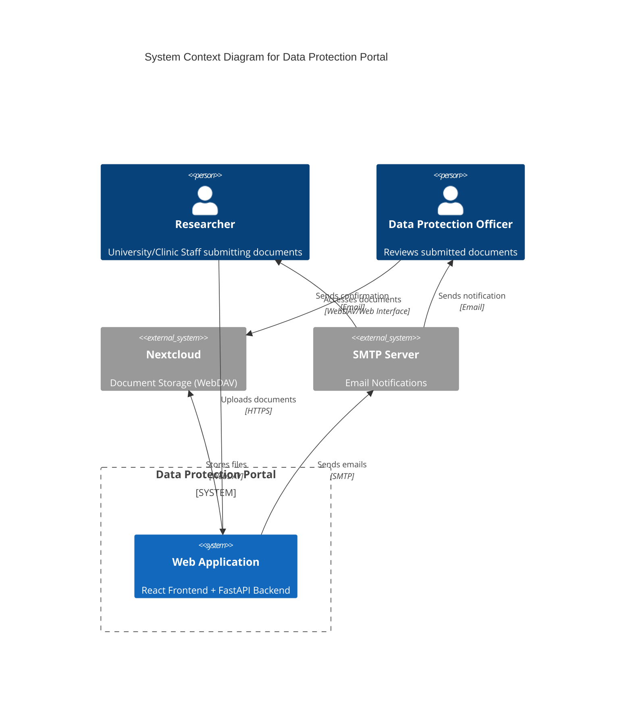

# Datenschutzportal

Das Datenschutzportal ist eine webbasierte Anwendung zur sicheren Einreichung und Verwaltung von datenschutzrelevanten Dokumenten für Forschungsprojekte.

## System Überblick

## Features

- **Intuitive Workflow**: Schritt-für-Schritt Prozess zur Projekteinreichung.
- **Sicherer Upload**: Dateien werden direkt in eine gesicherte Nextcloud-Instanz hochgeladen.
- **Validierung**: Automatische Prüfung auf Vollständigkeit und Dateiformate.
- **Benachrichtigungen**: Automatische E-Mail-Bestätigungen für Einreicher und das Datenschutz-Team.
- **Mehrsprachigkeit**: Vollständige Unterstützung für Deutsch und Englisch.

## Quick Links

- [Backend Setup](backend/setup.md)
- [API Dokumentation](backend/api.md)
- [Frontend Architektur](frontend/architecture.md)
- [Deployment Guide](deployment/index.md)
