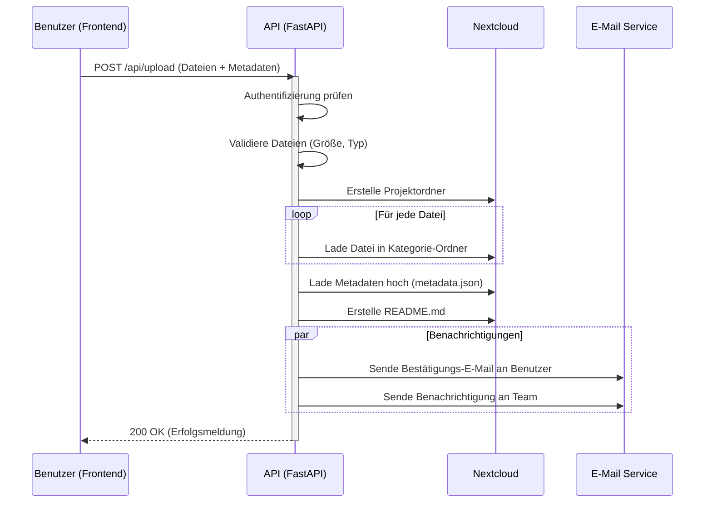

# API Dokumentation

Das Backend basiert auf FastAPI und stellt Endpunkte für Dokumenten-Uploads, Projektmanagement und System-Health-Checks bereit.

## Authentifizierung

Die API ist durch Bearer Tokens geschützt. Der Token muss im Header jeder Anfrage (außer Health-Check) mitgesendet werden.

**Header:**
`Authorization: Bearer <Ihr-Token>`

Der Token wird in der `.env` Datei (`API_TOKEN`) konfiguriert.

## Endpunkte

### Upload

#### `POST /api/upload`

Lädt Datenschutzdokumente in die Nextcloud hoch und löst Benachrichtigungen aus.

**Authentifizierung:** Erforderlich

**Parameter (Multipart/Form-Data):**

| Name | Typ | Beschreibung | Pflichtfeld |
|------|------|-------------|:--------:|
| `email` | string | E-Mail-Adresse des Einreichers | Ja |
| `uploader_name` | string | Name des Einreichers | Nein |
| `project_title` | string | Titel des Projekts | Ja |
| `institution` | string | "university" oder "clinic" | Ja |
| `is_prospective_study` | boolean | Handelt es sich um eine prospektive Studie? | Nein |
| `project_details` | string | Zusätzliche Details | Nein |
| `files` | list[file] | Liste der hochzuladenden Dateien | Ja |
| `file_categories` | string | JSON-String der Dateinamen auf Kategorien abbildet | Nein |
| `project_type` | string | "new" oder "existing" | Nein (Standard: "new") |

**Antwort:**

```json
{
  "success": true,
  "project_id": "Projekt_Titel_2023-10-27",
  "timestamp": "2023-10-27T10:00:00.000000",
  "files_uploaded": 3,
  "message": "Documents uploaded successfully"
}
```

#### `GET /api/upload/status/{project_id}`

Ruft den Upload-Status und Metadaten für ein bestimmtes Projekt ab.

**Authentifizierung:** Erforderlich

**Parameter:**

| Name | Typ | Beschreibung | Pflichtfeld |
|------|------|-------------|:--------:|
| `project_id` | string | Die ID des Projekts | Ja |

**Antwort:**

Gibt das Metadaten-Objekt des Projekts zurück.

### Projekte

#### `GET /api/`

Listet alle Projekte auf.

*Hinweis: Dieser Endpunkt gibt aktuell eine leere Liste zurück und dient als Platzhalter.*

**Authentifizierung:** Nicht explizit definiert (Router-Level möglich)

**Antwort:**
```json
[]
```

### Health

#### `GET /api/health`

Health-Check Endpunkt.

**Authentifizierung:** Nicht erforderlich

**Antwort:**
```json
{
  "status": "ok"
}
```

## Upload Workflow


