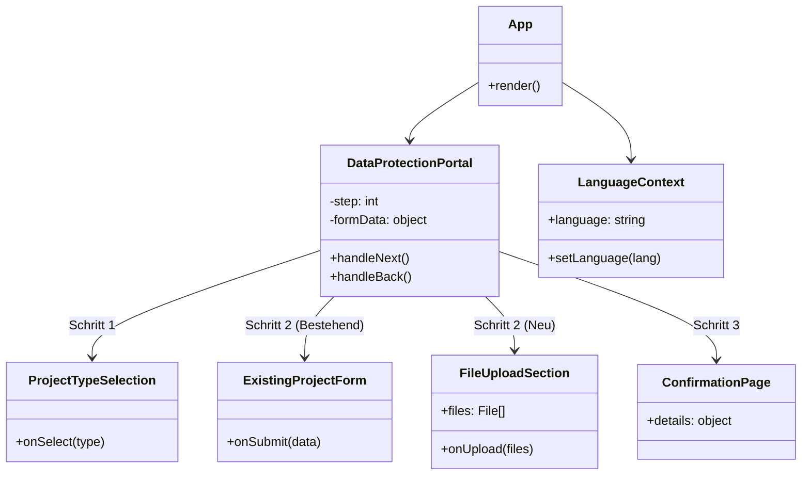

# Frontend Architektur

Das Frontend ist eine React-Anwendung, die mit TypeScript, Vite und Tailwind CSS erstellt wurde. Sie verwendet die Radix UI Bibliothek für barrierefreie Komponenten.

## Komponenten-Struktur

Die Anwendung ist um eine zentrale Wizard-ähnliche Oberfläche (`DataProtectionPortal`) herum strukturiert.

## Schlüssel-Komponenten

### `DataProtectionPortal`
Die Haupt-Container-Komponente, die den Workflow-Status verwaltet (aktueller Schritt, gewählte Institution, Projekttyp).

### `FileUploadSection`
Verwaltet den Drag-and-Drop Datei-Upload, die Dateikategorisierung und die Fortschrittsanzeige.

### `ExistingProjectForm`
Ein Formular zur Angabe von Details für bestehende Projekte (z.B. Nachreichen von Dokumenten zu einem bereits eingereichten Projekt).

### `ConfirmationPage`
Zeigt eine Zusammenfassung der hochgeladenen Dateien und Projektdetails nach erfolgreicher Übermittlung an.

## State Management

- **Context API**: `LanguageContext` wird für die Verwaltung der Internationalisierung verwendet.
- **Custom Hook**: Der gesamte Workflow-Status (Formulardaten, aktueller Schritt, Validierung) wird durch den Custom Hook `useDataProtectionWorkflow` verwaltet. Dieser trennt die Logik von der UI-Darstellung in `DataProtectionPortal`.
- **Lokaler State**: UI-spezifischer State (z.B. für Modals) verbleibt in den jeweiligen Komponenten.

## Styling

- **Tailwind CSS 4.0**: Utility-first CSS Framework.
- **Radix UI**: Headless UI Komponenten für Barrierefreiheit (Dialog, Accordion, etc.).
- **Shadcn UI**: Wiederverwendbare Komponenten basierend auf Radix UI und Tailwind (zu finden in `src/components/ui`).
